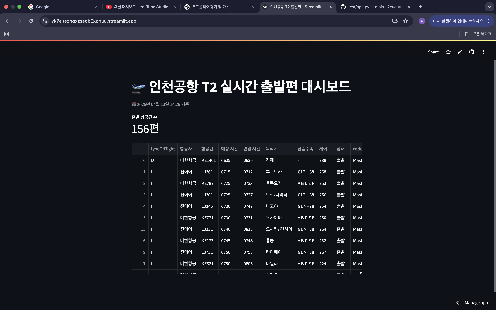

# 🛫 Incheon Airport T2 Real-Time Departure Dashboard

  
  
  

> [🌐 **Live Dashboard**](https://yk7ajtezhqxzseqb5xphuu.streamlit.app/)  
> A real-time dashboard that displays **departure flights from Incheon Airport Terminal 2** using public data.

---

## ✨ Features

- ✅ Automatically fetches today's departures on every visit
- ✅ Filters flights for **Terminal 2 only**
- ✅ Removes **codeshare (Slave)** flights for clarity
- ✅ Displays clean table with **scheduled & estimated times**
- ✅ Timezone is set to **KST (UTC+9)**

---

## ⚙️ Tech Stack

| Tool        | Description                        |
|-------------|------------------------------------|
| Python      | Main programming language          |
| Streamlit   | Web app frontend                   |
| requests    | Fetching flight data from API      |
| pandas      | Organizing & visualizing the data  |
| zoneinfo    | Korean timezone support (UTC+9)    |

---

## 🔄 How It Works

1. Detects current date in KST (Korean Standard Time)
2. Sends a request to the Incheon Airport Open API
3. Filters results:
   - Terminal 2 only
   - Excludes codeshare flights
4. Displays:
   - Flight count summary
   - Full departure table sorted by scheduled time

---

## 📡 Data Source

- API: [Incheon Airport Open API](https://www.data.go.kr/data/15083281/openapi.do)
- Provider: **Incheon International Airport Corporation**
- Endpoint: `getPassengerDeparturesOdp`

---

## 🙋‍♀️ Developer

- GitHub: [2eueu_](https://github.com/2eueu)
- Built for: Effortless real-time departure tracking from ICN T2

---

## ✅ Try It Now

> 🔗 [https://yk7ajtezhqxzseqb5xphuu.streamlit.app/](https://yk7ajtezhqxzseqb5xphuu.streamlit.app/)

The app updates **automatically** — no manual data refresh needed.

---

